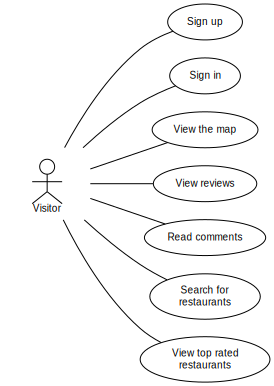
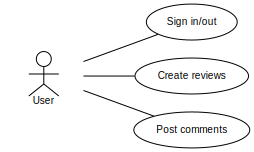
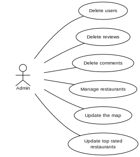
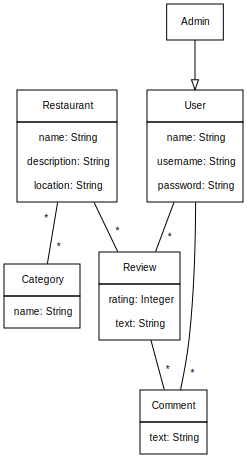
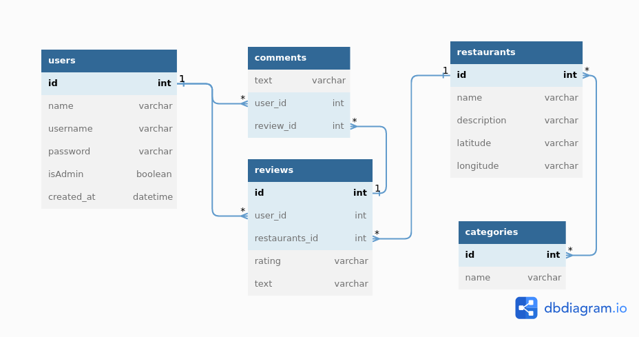

# Ravintolasovellus

> Sovelluksessa näkyy tietyn alueen ravintolat, joista voi etsiä tietoa ja lukea arvioita. Jokainen käyttäjä on peruskäyttäjä tai ylläpitäjä.

- [ ] Käyttäjä voi kirjautua sisään ja ulos sekä luoda uuden tunnuksen.
- [ ] Käyttäjä näkee ravintolat kartalla ja voi painaa ravintolasta, jolloin siitä näytetään lisää tietoa (kuten kuvaus ja aukioloajat).
- [ ] Käyttäjä voi antaa arvion (tähdet ja kommentti) ravintolasta ja lukea muiden antamia arvioita.
- [ ] Ylläpitäjä voi lisätä ja poistaa ravintoloita sekä määrittää ravintolasta näytettävät tiedot.
- [ ] Käyttäjä voi etsiä kaikki ravintolat, joiden kuvauksessa on annettu sana.
- [ ] Käyttäjä näkee myös listan, jossa ravintolat on järjestetty parhaimmasta huonoimpaan arvioiden mukaisesti.
- [ ] Ylläpitäjä voi tarvittaessa poistaa käyttäjän antaman arvion.
- [ ] Ylläpitäjä voi luoda ryhmiä, joihin ravintoloita voi luokitella. Ravintola voi kuulua yhteen tai useampaan ryhmään.

## User Stories:

### Actors
List here the actors in the user stories
- Visitor: user that has not logged in yet
- User: a logged in member
- Admin: a user that has special priviliges

### Visitor Stories:
- [ ] A visitor can make an account 
- [ ] A visitor can interact with the map
- [ ] A visitor see reviews
- [ ] A visitor can read comments
- [ ] A visitor can search for specific restaurants
- [ ] A visitor can see a list of top rated restaurants

### Users Stories:
- [ ] A User can do everithing that visitor can
- [ ] A User can loggin and loggout
- [ ] A User can write reviews
- [ ] A User can post comments

### Admin Stories:
- [ ] An Admin can manage restaurants
- [ ] An Admin can delete reviews
- [ ] An Admin can delete users
- [ ] An Admin can delete comments
- [ ] An Admin can update the map
- [ ] An Admin can update top rated restaurants

## Data

### Model

### Database
